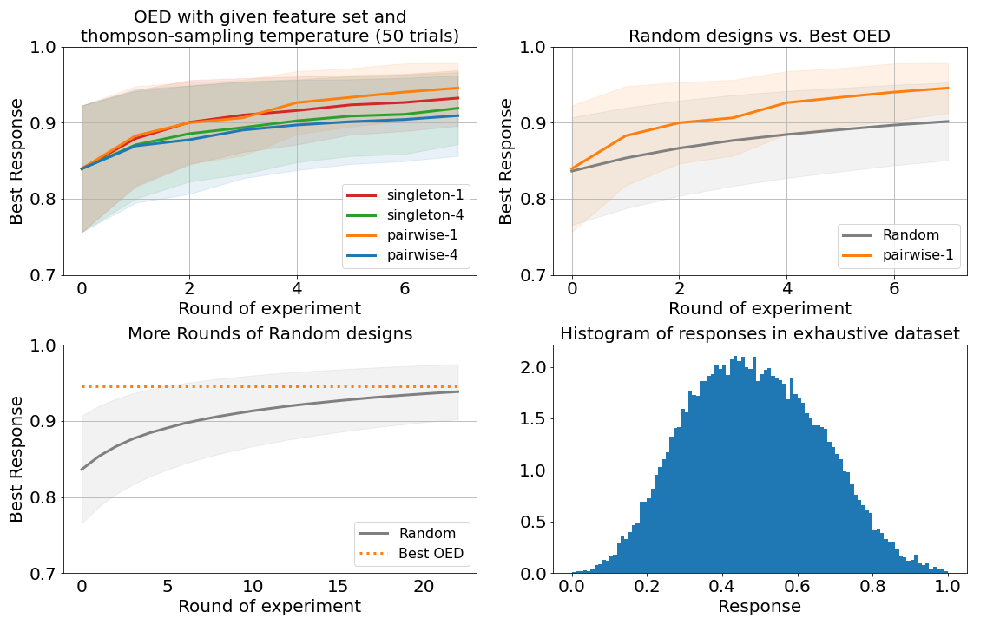

[](https://github.com/broadinstitute/pyroed/actions)
[](https://broadinstitute.github.io/pyroed/)

# Bayesian optimization of discrete sequences

Pyroed is a framework for model-based optimization of sequences of discrete
choices with constraints among choices.
Pyroed aims to address the regime where there is very little data (100-10000
observations), small batch size (say 10-100), short sequences (length 2-100) of
heterogeneous choice sets, and possibly with constraints among choices at
different positions in the sequence.

Under the hood, Pyroed performs Thompson sampling against a Bayesian linear
regression model that is automatically generated from a Pyroed problem
specification, deferring to [Pyro](https://pyro.ai) for Bayesian inference
(either variational or mcmc) and to annealed Gibbs sampling for discrete
optimization.
All numerics is performed by [PyTorch](https://pytorch.org).

## Installing

You can install directly from github via
```sh
pip install https://github.com/broadinstitute/pyroed/archive/main.zip
```
For developing Pyroed you can install from source
```sh
git clone git@github.com:broadinstitute/pyroed
cd pyroed
pip install -e .
```

## Quick Start

### 1. Specify your problem in the Pyroed language

First specify your sequence space by declaring a `SCHEMA`, `CONSTRAINTS`, `FEATURE_BLOCKS`, and `GIBBS_BLOCKS`. These are all simple Python data structures.
For example to optimize a nucleotide sequence of length 10:
```python
# Declare the set of choices and the values each choice can take.
SCHEMA = OrderedDict()
for i in range(10):
    SCHEMA[f"nuc{i}"] = ["A", "C", "G", "T"]

# Declare some constraints. See pyroed.constraints for options.
CONSTRAINTS = [AllDifferent("nuc0", "nuc1", "nuc2"),
               Iff(TakesValue("nuc8", "T"), TakesValue("nuc9", "T"))]

# Specify that the Bayesian linear regression model incorporates coefficients for 
# each nucleotide and for each consecutive pair of nucleotides.
single_blocks = list(SCHEMA)
pair_blocks = [[a, b] for a, b in zip(single_blocks[:-1], single_blocks[1:])]
FEATURE_BLOCKS = single_blocks + pair_blocks

# Finally define Gibbs sampling blocks for the discrete optimization.
GIBBS_BLOCKS = pair_blocks
```

### 2. Declare your initial experiment

An experiment consists of a set of `sequences` and the experimentally measured
`responses` of those sequences.
```python
sequences = ["ACGAAAAAAA", "ACGAAAAATT", "AGTTTTTTTT"]
responses = torch.tensor([0.1, 0.2, 0.6])

# Collect these into a dictionary that we'll maintain throughout our workflow.
design = pyroed.encode_design(SCHEMA, sequences)
experiment = pyroed.start_experiment(SCHEMA, design, responses)
```

### 3. Iteratively create new designs

At each step of our optimization loop, we'll query Pyroed for a new design.
Pyroed choose the design to balance exploitation (finding sequences with high
response) and exploration.
```python
design = pyroed.get_next_design(
    SCHEMA, CONSTRAINTS, FEATURE_BLOCKS, GIBBS_BLOCKS, experiment, design_size=3
)
new_seqences = ["".join(s) for s in pyroed.decode_design(SCHEMA, design)]
print(new_sequences)
# ["CAGTTGTTGC", "GCACTCAGTT", "TAGCGTTGTT"]
```
Then we'll go to the lab, measure the responses of these new sequences, and
append the new results to our experiment:
```python
new_responses = torch.tensor([0.04, 0.3, 0.25])
experiment = pyroed.update_experiment(SCHEMA, experiment, design, new_responses)
```
We repeat step 3 as long as we like.


### 4. Demo: Semi-Synthetic Experiment 


